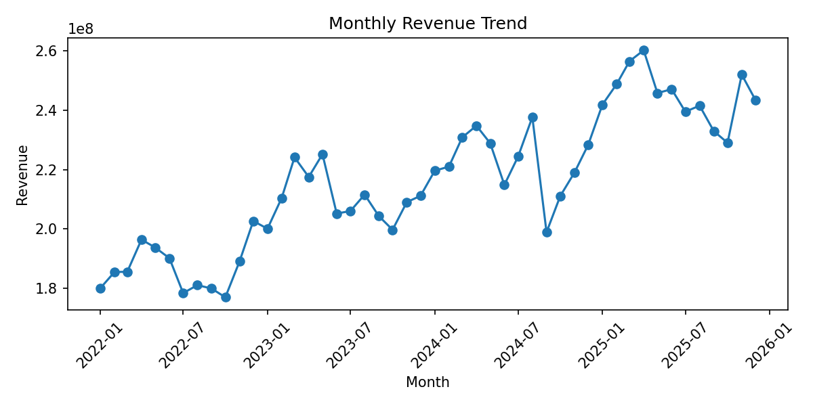
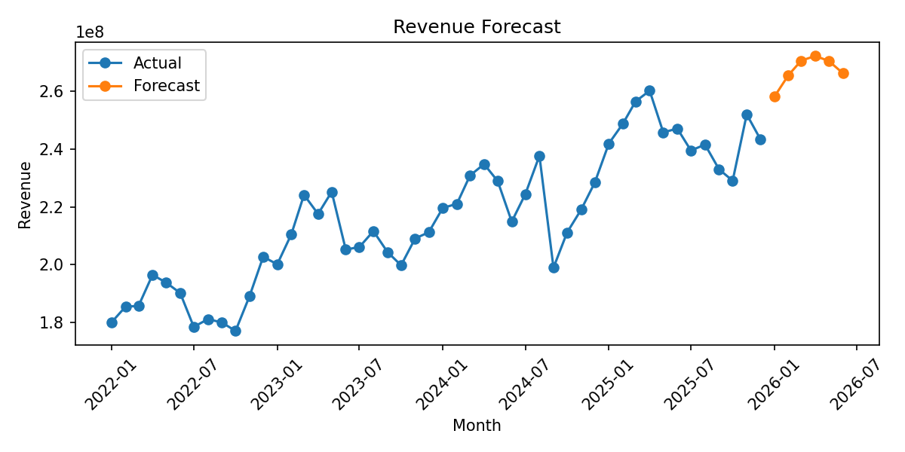

<div align="center">

# Revenue Forecasting Using Time Series Analysis

### Monthly Revenue Forecasting for Planning and Business Decision Support

**Python · Pandas · Scikit-learn · Time Series · Business Analytics**

</div>

---

## Overview

This project forecasts future monthly revenue using synthetic time-series data.

It demonstrates an end-to-end analytical workflow covering data understanding, trend analysis, seasonality feature engineering, time-based train-test splitting, model training, evaluation, and business interpretation.

---

## Business Problem

Companies need revenue projections to support:

- Sales target planning
- Capacity planning
- Growth evaluation
- Budget preparation
- Strategic decision-making
- Identification of potential revenue slowdowns

---

## Dataset

The synthetic dataset is stored in:

```text
data/monthly_revenue.csv
```

Main columns:

| Column | Description |
|---|---|
| `month` | Monthly observation period |
| `revenue` | Monthly revenue value |

The dataset can be replaced with real monthly revenue data that follows the same structure.

---

## Methodology

1. Data understanding
2. Time-series visualization
3. Trend analysis
4. Seasonality feature engineering
5. Time-based train-test split
6. Forecasting model
7. Model evaluation
8. Business recommendation

---

## Model

The current implementation uses:

- Linear Regression
- Trend features
- Seasonality features

Potential future models:

- Moving Average
- ARIMA
- SARIMA
- Prophet
- XGBoost Regressor

---

## Evaluation Result

Baseline result on the synthetic dataset:

| Metric | Score |
|---|---:|
| MAE | 5,643,424 |
| MAPE | 2.35% |

> These values are based on synthetic portfolio data and should not be treated as production performance.

---

## Revenue Trend



---

## Forecast Result



The generated forecast data is available at:

```text
images/forecast_result.csv
```

---

## Business Insight

Revenue forecasting helps estimate expected income for upcoming periods.

The result can support:

- Revenue target setting
- Sales-strategy adjustment
- Capacity planning
- Identification of potential declining periods
- Management discussions based on forward-looking estimates

---

## Project Structure

```text
revenue-forecasting-time-series/
├── data/
│   └── monthly_revenue.csv
├── images/
│   ├── forecast_result.csv
│   ├── forecast_result.png
│   └── revenue_trend.png
├── notebook/
│   └── revenue_forecasting.ipynb
├── src/
│   └── forecast_revenue.py
├── .gitignore
├── LICENSE
├── README.md
├── README_England.md
└── requirements.txt
```

---

## How to Run

Install dependencies:

```bash
pip install -r requirements.txt
```

Run the Python script:

```bash
python src/forecast_revenue.py
```

Open the notebook:

```bash
jupyter notebook notebook/revenue_forecasting.ipynb
```

---

## Data Workflow

```text
Monthly Revenue CSV
        ↓
Date Parsing and Sorting
        ↓
Trend Visualization
        ↓
Seasonality Feature Engineering
        ↓
Time-Based Train-Test Split
        ↓
Linear Regression Model
        ↓
Forecast and Evaluation
        ↓
CSV and PNG Outputs
```

---

## Recommended Improvements

- Add a naive baseline
- Compare multiple forecasting models
- Add walk-forward validation
- Add confidence intervals
- Add schema and missing-period validation
- Add experiment tracking
- Add automated model comparison

---

## Skills Demonstrated

- Time-series analysis
- Data preparation
- Trend and seasonality analysis
- Feature engineering
- Regression modeling
- Forecast evaluation
- Data visualization
- Business interpretation
- Reproducible Python workflow

---

<div align="center">

**From historical revenue to forward-looking business insight.**

</div>
